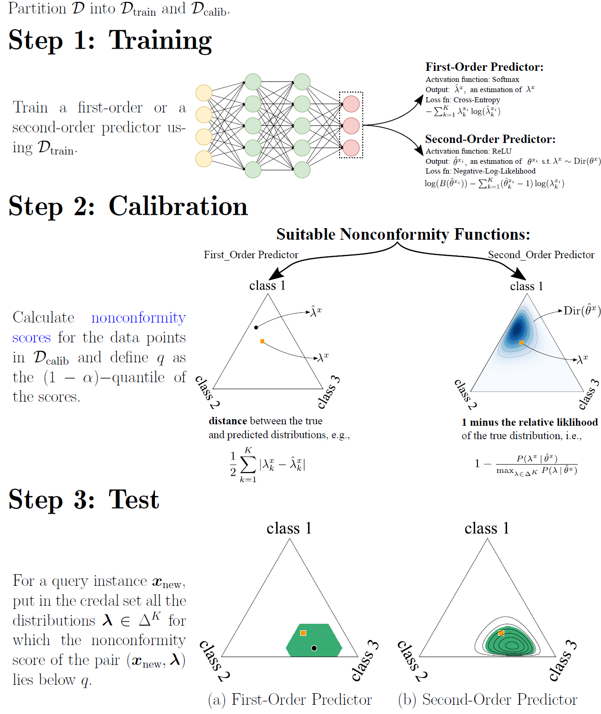

# Conformalized Credal Set Predictors
This repo has the code for the paper [Conformalized Credal Set Predictors](https://neurips.cc/virtual/2024/poster/93218) written by Alireza Javanmardi, David Stutz, and Eyke Hüllermeier. This paper appears in the thirty-eighth annual conference on Neural Information Processing Systems (NeurIPS 2024).

The uncertainty of a learner in classification can be effectively represented by a credal set, which is a set of probability distributions over classes. For a given input instance, a credal set not only captures the uncertainty about the true label (i.e., aleatoric uncertainty) but also reflects the uncertainty of the learner regarding the probability distribution over labels (i.e., epistemic uncertainty).

This paper demonstrates how to construct such credal sets using conformal prediction when each data instance is associated with a probability distribution over labels rather than a single crisp label.



## Setup

To set up the conda environment, follow these steps:

```bash
conda create --name ENV_NAME python=3.9
conda activate ENV_NAME
pip install -r requirements.txt
```


To execute the code, such as for the chaosNLI dataset, proceed as follows:

Run the script for chaosNLI training and calibration, starting with seed 2 and first-order:
```bash
python chaos_NLI_training_calibration.py 2 first
```
Subsequently, execute the script for chaosNLI testing with seed 2 and alpha value 0.2:
```bash
python chaos_NLI_test.py 2 0.2
```
Ensure you replace ENV_NAME with the name you prefer for your environment. Adjust the commands according to your specific requirements.

## Citation
If you use this code, please cite the paper
```
@inproceedings{javanmardi2024credal,
 author = {Javanmardi, Alireza and Stutz, David and H\"{u}llermeier, Eyke},
 booktitle = {Advances in Neural Information Processing Systems},
 title = {Conformalized Credal Set Predictors},
 year = {2024}
}
```
